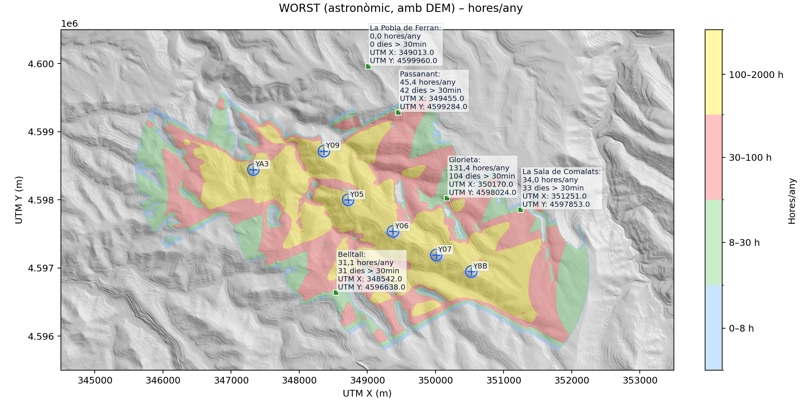

# Shadow Flicker Assessment

**If you encounter any issues, please don't hesitate
to [report them](https://github.com/leotiger/shadow-flicker-assessment/issues).**

The **Shadow Flicker Assessment** allows you to visualize shadow flicker caused by wind turbines.
The tool implements the [German protocol for Shadow Flicker assessment](https://www.lai-immissionsschutz.de/documents/wka_schattenwurfhinweise_stand_23_1588595757.01.pdf) which is a de facto standard applied in many countries,
including Spain, Catalonia, Germany, Chile and many, many others.

The tool is not meant for oficial documentation, this tool helps you to check shadow flicker studies provided by promotors for their projects within the process to obtain environmental approval for their proposed projects.

Nevertheless, the **Shadow Flicker Assessment** obtains reliable results comparable to professional assessment tools used by the industry like WindPro.

## Installation

Shadow Flicker Assessment is a command line script for python.
Your python enviroment needs to be setup to support all necessary libraries.
Please use conda or pip to install all missing libraries if the script complains on execution.

## Requirements

python with support for:

- matplotlib
- rasterio
- numpy
- shapely
- numba

The rest of imported libraries should be available within your standard python environment.

## Configuration

The Shadow Flicker Assessment tool reads project configurations via command line args using a .yaml file to 
obtain essential project data, e.g. wind turbine(s) data, receptors data, elevation map data (DEM)...

You can use the --fast (-f) flag to run quick tests which reduces the calculation amount considerably. For final assessments you should
run the script without the fast flag, but be advised that the script may run for hours as the computational workload is impressive.

To run only one of the two scenarios available, WORST and REALISTIC, please provide the scenario using the --scene (-s) flag.

To run assessments for specific projects you'll have to gather a lot of data first. Once you have the data available you can edit the assessment configuration .yaml for the wind park you want to investigate. You provide your .yaml configuration via the --config (-c) flag.

To run the assessment tool you will need to provide a DEM tiff file and you need to prepare the oficial DEM files into a unique set that reflecte the terrain afected. Below you'll find an example to produce an elevation raster map for given UTM coordinates and the correspondig official map tiles:

``
gdalwarp -t_srs EPSG:25831 -te 342000 4604000 355000 4596000 \
  -r bilinear -of GTiff -co COMPRESS=LZW \
  PNOA_MDT05_ETRS89_HU30_0390_LID.tif \
  PNOA_MDT05_ETRS89_HU30_0418_LID.tif \
  PNOA_MDT05_ETRS89_HU31_0390_LID.tif \
  PNOA_MDT05_ETRS89_HU31_0418_LID.tif \
  DEM_clip_5m-rpglobal.tif
``

## Assessment

The German protocol states that the Worst Case is the basis to consider regulations and obligations for the project once a project proposal exceeds the limits of 30 hours / year and 30 minuts / day under Worst Case conditions.

In operating conditions the limits are more restrictive and allow for a maximum of 8 hours of accumulated shadow flicker per year and a maximum of 3 days exceeding 30 minutes. Both limits have to be fullfilled independently.

"Of relevance are the actual or perceptible immissions occurring at an immission site, which may only arise under certain weather conditions. An effect caused by expected periodic shadow flicker is not considered significantly disturbing if the astronomically maximum possible shadowing duration, taking into account cumulatively all contributions from wind turbines (WKA) at the respective immission site at a reference height of 2 m above ground level, does not exceed 30 hours per calendar year and, moreover, does not exceed 30 minutes per calendar day.

In assessing the degree of disturbance, an average sensitive person was used as the benchmark.

If the values for the astronomically maximum possible shadowing duration are exceeded, technical measures to limit the operating times of the wind turbines may be considered. An important technical measure, often imposed as a condition or requirement, is the installation of a shutdown system that, by means of radiation or illuminance sensors, detects the actual meteorological shadowing situation and thereby limits the actual local shadowing duration.

Since the value of 30 hours per calendar year was developed on the basis of the astronomically possible shadowing, a corresponding value for the actual, real shadowing duration – the meteorological shadowing duration – is set for shutdown systems. According to [2], this value is 8 hours per calendar year." (https://www.lai-immissionsschutz.de/documents/wka_schattenwurfhinweise_stand_23_1588595757.01.pdf)

The **Shadow Flicker Assessment** tool implements the German protocol in a strict way avoiding overestimation of shadow flicker. As a basic rule, every wind park (operating or in development) has to implement protocols to prevent shadow flicker once the Worst Case results prove to be over the limits for sensible receptors.

## Results

The script delivers 4 files for each scenerio:

- The hours/year graphics plot
- The days/year graphics plot
- The minuts/day graphics plot
- A summary csv file including configuration parameters and essential results for receptors

### Important

Despite having been reviewed and found error free, be advised that this script is a helper tool. You may want (or need) to calculate some data points manually to prove correctness of the assumptions and results provided by this script.

### ToDo

- [x] Clean and improve code base
- [x] Export of all data for traceability
- [x] Improve yaml documentation and comments
- [x] Make timezone aware and export all data, not only cummulative data
- [x] Translations and i18n support

